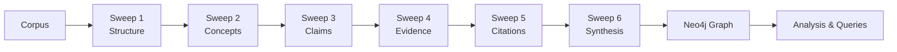

# SweepGraph Documentation

**Note:** This README serves dual purposes:
- **Traditional documentation** for reading on GitHub
- **Interactive knowledge base** for LLM-assisted implementation so copy it in full and drop into an llm of choice....

When provided to an LLM (Claude, ChatGPT, etc.), this document enables context-aware assistance with setup, debugging, prompt engineering, and domain-specific customization. The LLM can guide you through implementation details, troubleshoot technical issues, and adapt the methodology to your specific corpus and research questions.

### Example: LLM-Assisted Implementation

**Researcher Query:** "I need to analyze a PhD thesis on climate policy. I haven't used Neo4j before."

**LLM Response Pattern:**
```
Analysis of requirements:
- Document type: Academic thesis (~200-400 pages)
- Domain: Climate policy (concepts, arguments, evidence, citations)
- Technical background: New to graph databases

Recommended implementation path:

Phase 1: Environment Setup (30-45 minutes)
- Neo4j Desktop installation (recommended for development)
- Python 3.11+ and dependency management
- API configuration for LLM access
- Repository setup and environment configuration

Phase 2: Initial Extraction (1-2 hours)
- Structure sweep: Document hierarchy
- Import to Neo4j for validation
- Basic Cypher queries for verification

Phase 3: Progressive Enrichment (iterative)
- Domain concept extraction
- Argument and claim identification
- Evidence mapping
- Citation network construction
- Gap analysis

Required information:
- Source format (.txt, .pdf, .docx)
- Operating system
- Analysis scope (full thesis or specific chapters)
```

This demonstrates how the documentation enables context-aware technical assistance.

---

## Instructions for AI Assistants

**Context:** This repository contains SweepGraph—a methodology for progressive knowledge graph extraction from text corpora using layered LLM sweeps and Neo4j.

**Assistant Capabilities:**
- Technical guidance for Neo4j setup, configuration, and troubleshooting
- Prompt engineering for domain-specific extraction quality
- Sweep sequence design based on corpus characteristics
- Cypher query development and optimization
- Python implementation assistance
- Performance tuning and scalability recommendations

**Initial Assessment Requirements:**
1. Corpus characteristics:
   - Document type and domain
   - Volume and structure
   - Research objectives
2. Technical background:
   - Graph database experience
   - Programming proficiency
   - LLM prompt engineering familiarity
3. Implementation goals:
   - Analysis scope
   - Output requirements
   - Timeline constraints

**User Scenarios and Technical Guidance:**

**1. Academic Researchers (New to Graph Databases)**
   - Neo4j Desktop setup for development environment
   - Graph model fundamentals (nodes, relationships, properties)
   - Initial structure sweep for validation
   - Progressive sweep sequence design
   - Query development for research questions

**2. Research Teams (Data Analysis Focus)**
   - Research question mapping to graph patterns
   - Domain-specific sweep sequencing:
     - Thesis analysis: Structure → Concepts → Claims → Evidence → Citations
     - Paper processing: Concepts → Methods → Results → Citations
     - Legal analysis: Structure → Definitions → Precedents → Arguments
   - Terminology extraction and standardization
   - Cross-document relationship identification

**3. Technical Professionals (Database Background)**
   - Graph vs. relational model comparison
   - Cypher query optimization
   - Sweep template architecture
   - Advanced features: merge operations, export utilities, schema validation
   - Performance tuning and indexing strategies

**4. Technical Issue Resolution**
   - **Connection failures**: Docker service status, credential verification, network configuration
   - **API errors**: Authentication, rate limiting, timeout configuration
   - **JSON parsing**: Output validation, schema compliance, error recovery
   - **Empty extraction**: Corpus loading verification, prompt refinement, example inclusion
   - **Performance degradation**: Index creation, constraint definition, query optimization

**5. Domain Specializations**
   - **Legal corpus**: Precedent extraction, statutory analysis, reasoning chains
   - **Scientific literature**: Methodology extraction, result mapping, hypothesis tracking
   - **Technical documentation**: API discovery, dependency mapping, configuration management
   - **Literary analysis**: Character networks, thematic structures, narrative patterns
   - **Business process**: Stakeholder mapping, requirement tracking, risk identification

**Key Files You Can Reference:**
- `.env.example` - Configuration template
- `scripts/templates/sweep_template.py` - Sweep script template
- `prompts/v5/templates/prompt_template.txt` - Prompt template
- `scripts/import_to_neo4j.py` - Import utility
- `frontend/app.py` - Streamlit UI entry point

**Communication Guidelines:**
- Provide clear, technically accurate guidance
- Assess user background before recommending approaches
- Estimate realistic time requirements
- Focus on methodological rigor and validation
- Prioritize troubleshooting and error resolution

**Best Practices:**
- Gather requirements before suggesting solutions
- Adapt technical depth to user background
- Use concrete examples from relevant domains
- Provide step-by-step implementation guidance when appropriate
- Emphasize validation and quality assurance throughout the process

---

# SweepGraph: Progressive Knowledge Graph Extraction

[](LICENSE)
[](#)
[](https://www.python.org/downloads/)
[](https://neo4j.com/)

**A methodology for transforming text corpora into structured, queryable knowledge graphs**

SweepGraph enables systematic extraction and representation of complex documents as Neo4j graphs, facilitating analysis of relationships, identification of patterns, and discovery of structural gaps in large text corpora.

---

## Overview

**SweepGraph is a methodology and framework for progressive knowledge extraction from text corpora.**

The system employs iterative extraction passes ("sweeps"), each targeting specific information types. This layered approach addresses the limitations of monolithic extraction attempts by decomposing complex analysis into focused, manageable tasks:

1. **Structure Extraction:** Document hierarchy (chapters, sections, subsections)
2. **Concept Identification:** Key terminology, definitions, theoretical frameworks
3. **Claim Extraction:** Arguments, hypotheses, assertions
4. **Evidence Mapping:** Supporting data, citations, empirical support
5. **Citation Network:** Reference relationships and scholarly context
6. **Relationship Synthesis:** Cross-cutting connections between extracted entities
7. **Analytical Sweeps:** Gap identification, reasoning chain analysis, quality validation

Each sweep builds upon the graph structure established by previous passes, enabling progressive enrichment of the knowledge representation.

**Methodological Advantages:**
- Focused extraction tasks improve LLM output quality and consistency
- Iterative refinement captures information missed in initial passes
- Incremental validation enables early error detection and correction
- LLM-agnostic architecture supports multiple providers (Gemini, Claude, GPT-4, local models)
- Domain-adaptable framework applies to diverse text types

---

## Application Domains

**Academic Research:**
- Dissertation and thesis structural analysis
- Argument extraction and validation
- Automated citation network construction
- Literature review gap identification
- Evidence chain mapping and verification

**Legal Corpus Analysis:**
- Case law precedent extraction and relationship mapping
- Statutory framework analysis
- Judicial reasoning pattern identification
- Interpretive conflict detection
- Argument dependency graph construction

**Technical Documentation:**
- API relationship discovery and mapping
- System architecture dependency analysis
- Configuration parameter tracking
- Workflow and process documentation
- Cross-system integration mapping

**Literary and Textual Analysis:**
- Character relationship networks
- Thematic structure mapping
- Narrative pattern identification
- Discourse analysis
- Intertextual connection discovery

**Applicability:**
The methodology applies to any structured text corpus containing identifiable entities (concepts, agents, events) and relationships. Domain-specific sweep sequences can be designed for specialized analysis requirements.

---

## ⚡ Quick Demo (5 Minutes)

Want to see it work right away? Run the quickstart helper to load a sample corpus, generate the structure sweep JSON, and push it into Neo4j (if your credentials are configured):

```bash
uv run python scripts/utilities/quickstart_demo.py
```

The command confirms `data/raw/sample_corpus.txt`, writes `output/neo4j_ready/sample_sweep01_structure.json`, and attempts the import. Add `--skip-import` to create the files without touching Neo4j.

---

## 🚀 Quick Start (30 Minutes)

### Step 0: Install Prerequisites

**You'll need:**
- **Docker Desktop** → https://docs.docker.com/get-docker/
- **Python 3.11+** → https://www.python.org/downloads/
- **Gemini API key** → https://ai.google.dev/gemini-api/docs/get-started (free tier works)

**Install uv (recommended Python package manager):**
```bash
curl -LsSf https://astral.sh/uv/install.sh | sh
```

**Choose your Neo4j setup:**

**Option A: Neo4j Desktop (Easiest for beginners)**
1. Download from https://neo4j.com/download/
2. Install and create a new database
3. Start the database
4. Note: `bolt://localhost:7687` (default connection)

**Option B: Docker (Fastest for developers)**
```bash
docker run \
    --name neo4j \
    -p 7474:7474 -p 7687:7687 \
    -e NEO4J_AUTH=neo4j/your_password \
    neo4j:latest
```

**Option C: Neo4j Aura (Cloud, free tier)**
1. Create account at https://neo4j.com/cloud/aura/
2. Create free instance
3. Save connection URI and credentials

### Step 1: Clone and Configure

```bash
# Clone the repository
git clone https://github.com/Magnussmari/SweepGraph.git
cd SweepGraph

# Copy environment template
cp .env.example .env

# Edit .env with your credentials
# - NEO4J_URI, NEO4J_USER, NEO4J_PASSWORD
# - GOOGLE_API_KEY (Gemini)
nano .env  # or your editor of choice
```

### Step 2: Install Dependencies

```bash
# Install Python packages
uv sync

# Or with pip
pip install -r requirements.txt
```

### Step 3: Add Your Text Corpus

```bash
# Copy your thesis/document to data/raw/
cp /path/to/your/thesis.txt data/raw/corpus.txt

# Or PDF/DOCX (update paths in sweep scripts as needed)
```

### Step 4: Your First Sweep (Structure Extraction)

```bash
# Copy templates
cp scripts/templates/sweep_template.py scripts/sweep01_structure.py
cp prompts/v5/templates/prompt_template.txt prompts/v5/01_structure_extraction.txt

# Run the sweep (extracts chapters, sections, hierarchy)
uv run python scripts/sweep01_structure.py

# Import to Neo4j
uv run python scripts/import_to_neo4j.py output/neo4j_ready/sweep01_structure.json
```

### Step 5: Explore Your Graph

**Open Neo4j Browser:** http://localhost:7474

```cypher
// See all nodes
MATCH (n)
RETURN n
LIMIT 50

// View structure hierarchy
MATCH path = (t)-[:CONTAINS*]->(n)
RETURN path
```

**Or use the Streamlit UI:**
```bash
streamlit run frontend/app.py
```

Navigate to: http://localhost:8501

**🎉 You now have your first knowledge graph!**

---

## 🎼 The Progressive Sweep Philosophy

**Traditional Approach (Doesn't Work):**
```
You → "Extract everything from this 300-page thesis"
      ↓
   LLM tries and fails
      ↓
   Mediocre, incomplete results
```

**SweepGraph Approach (Works):**
```
Sweep 1 → Extract structure (chapters, sections)
Sweep 2 → Extract concepts (clear nodes now)
Sweep 3 → Extract claims (linked to sections)
Sweep 4 → Extract evidence (linked to claims)
Sweep 5 → Extract citations (complete context)
Sweep 6 → Connect concepts to claims
Sweep 7 → Analytical queries (find gaps, chains)
          ↓
   Rich, validated knowledge graph
```



**Why layered sweeps work:**
- **Focus**: Each prompt has one clear job
- **Context**: Later sweeps build on earlier structure
- **Quality**: You validate incrementally
- **Flexibility**: Skip, reorder, or add sweeps as needed
- **Debuggable**: Easy to see where issues arise

---

## 📚 Recommended Sweep Sequences

### For Academic Thesis/Dissertation

**Phase 1: Foundation (Sweeps 1-2)**
1. **Structure Sweep** - Chapters, sections, subsections
2. **Concept Sweep** - Key terms, definitions, theories

**Phase 2: Argumentation (Sweeps 3-4)**
3. **Claim Sweep** - Arguments, hypotheses, assertions
4. **Evidence Sweep** - Data, quotes, studies supporting claims

**Phase 3: Context (Sweep 5)**
5. **Citation Sweep** - References, authors, citation relationships

**Phase 4: Integration (Sweeps 6-7)**
6. **Relationship Sweep** - Connect concepts, claims, evidence
7. **Gap Analysis Sweep** - Find unsupported arguments, orphaned evidence

**Timeline:** 1-2 weeks of iterative refinement

### For Research Papers

1. **Metadata** - Authors, institutions, keywords
2. **Concepts** - Key terms and definitions
3. **Methods** - Experimental design, data sources
4. **Results** - Findings and interpretations
5. **Citations** - Reference network

**Timeline:** 2-3 days per paper

### For Legal Documents

1. **Structure** - Sections, articles, clauses
2. **Definitions** - Legal terms and interpretations
3. **Precedents** - Case citations and reasoning
4. **Arguments** - Legal claims and rebuttals
5. **Relationships** - How precedents relate

**Timeline:** 1 week per significant document

### For Technical Documentation

1. **Components** - Systems, modules, services
2. **Dependencies** - What requires what
3. **Configurations** - Settings and parameters
4. **Workflows** - Processes and sequences
5. **APIs** - Endpoints and relationships

**Timeline:** 3-5 days

---

## 🎨 The Streamlit Frontend

**Explore, edit, and monitor your graph visually.**

```bash
streamlit run frontend/app.py
```

**Three main pages:**

### 🔍 Explorer
- Filter nodes by label (Concept, Claim, Evidence, etc.)
- View node properties
- Sample relationships
- Search functionality

### ✏️ Editor
- Create relationships between nodes
- Delete relationships
- Read-only node viewing (safety)
- Relationship property editing

### 📊 Dashboard
- Node count by label
- Relationship type distribution
- Top relationships
- Graph statistics
- Quality metrics

**Configuration:** Edit `frontend/.streamlit/config.toml` for theming

---

## 🛠️ Creating Custom Sweeps

### Anatomy of a Sweep

**1. The Python Script** (`scripts/sweepXX_description.py`)
- Loads your corpus
- Sends to LLM with prompt
- Parses JSON response
- Validates structure
- Saves to `output/neo4j_ready/`

**2. The Prompt** (`prompts/v5/XX_description.txt`)
- Clear task description
- Output format (JSON schema)
- Rules and constraints
- Examples (optional but helpful)

**3. The Output** (`output/neo4j_ready/sweepXX_description.json`)
```json
{
  "nodes": [
    {
      "id": "concept:climate_change",
      "labels": ["Concept"],
      "properties": {
        "name": "Climate Change",
        "definition": "Long-term shifts in global temperatures...",
        "tier": "core",
        "confidence": "high"
      }
    }
  ],
  "relationships": [
    {
      "source_id": "concept:climate_change",
      "target_id": "claim:anthropogenic_warming",
      "type": "RELATES_TO",
      "properties": {
        "strength": "strong"
      }
    }
  ]
}
```

### Sweep Best Practices

**1. Use Consistent ID Patterns**
```python
# Good
"id": "concept:climate_change"
"id": "chapter:01"
"id": "claim:main_hypothesis"

# Bad
"id": "cc"
"id": "1"
"id": "random_string_123"
```

**2. Add Confidence Scores**
```json
{
  "confidence": "high",  // or "medium", "low"
  "source": "section_3.2"
}
```

**3. Preserve Context**
```json
{
  "text_excerpt": "First 200 chars of relevant text...",
  "page": 42,
  "section": "chapter_3.2"
}
```

**4. Test Incrementally**
- Run sweep on small corpus first
- Check JSON output before importing
- Validate in Neo4j Browser
- Refine prompt based on results

---

## 📊 Neo4j Query Cookbook

### Basic Exploration

```cypher
// Count nodes by label
MATCH (n)
RETURN labels(n)[0] as label, count(n) as count
ORDER BY count DESC

// Count relationships by type
MATCH ()-[r]->()
RETURN type(r) as relationship, count(r) as count
ORDER BY count DESC

// Find orphaned nodes (no relationships)
MATCH (n)
WHERE NOT (n)--()
RETURN n.name, labels(n)
```

### Structure Analysis

```cypher
// Find deepest hierarchy paths
MATCH path = (t)-[:CONTAINS*]->(n)
WHERE NOT (n)-[:CONTAINS]->()
RETURN path
ORDER BY length(path) DESC
LIMIT 10

// Chapters with most subsections
MATCH (c:Chapter)-[:CONTAINS*]->(s)
RETURN c.name, count(s) as subsections
ORDER BY subsections DESC
```

### Argumentation Analysis

```cypher
// Claims with most evidence
MATCH (e:Evidence)-[:SUPPORTS]->(c:Claim)
RETURN c.name, count(e) as evidence_count, c.confidence
ORDER BY evidence_count DESC

// Claims without evidence (gaps!)
MATCH (c:Claim)
WHERE NOT (c)<-[:SUPPORTS]-(:Evidence)
RETURN c.name, c.section

// Evidence chains
MATCH path = (e:Evidence)-[:SUPPORTS]->(c:Claim)-[:SUPPORTS]->(h:Hypothesis)
RETURN path
```

### Citation Network

```cypher
// Most cited authors
MATCH (c:Citation)<-[:CITES]-(content)
RETURN c.author, c.year, count(content) as times_cited
ORDER BY times_cited DESC
LIMIT 20

// Co-citation network (authors cited together)
MATCH (c1:Citation)<-[:CITES]-(n)-[:CITES]->(c2:Citation)
WHERE id(c1) < id(c2)
RETURN c1.author, c2.author, count(n) as co_citations
ORDER BY co_citations DESC
LIMIT 50
```

### Concept Relationships

```cypher
// Core concepts (high connectivity)
MATCH (c:Concept)
RETURN c.name, c.tier,
       size((c)-[:RELATES_TO]-()) as relationships
ORDER BY relationships DESC
LIMIT 20

// Concept clusters
MATCH (c1:Concept)-[:RELATES_TO*..2]-(c2:Concept)
WHERE c1.tier = 'core'
RETURN c1.name, collect(distinct c2.name) as related_concepts

// Orphaned concepts (potentially missing relationships)
MATCH (c:Concept)
WHERE NOT (c)-[:RELATES_TO]-()
  AND NOT (c)<-[:HAS_CONCEPT]-()
RETURN c.name, c.definition
```

### Quality Assurance

```cypher
// Low confidence nodes
MATCH (n)
WHERE n.confidence = 'low'
RETURN labels(n)[0] as type, n.name, n.source
ORDER BY type

// Nodes missing required properties
MATCH (n:Concept)
WHERE n.definition IS NULL
RETURN n.name

// Duplicate IDs (shouldn't happen, but check)
MATCH (n)
WITH n.id as id, collect(n) as nodes
WHERE size(nodes) > 1
RETURN id, size(nodes) as duplicates
```

---

## 🐛 Troubleshooting Guide

### "Neo4j connection refused"

**Symptoms:** Can't import data, frontend won't connect

**Solutions:**
1. **Check Neo4j is running**
   ```bash
   # Docker users
   docker ps | grep neo4j

   # Desktop users: Check Neo4j Desktop UI
   ```

2. **Verify .env credentials**
   ```bash
   cat .env | grep NEO4J
   # Should match your Neo4j password
   ```

3. **Test connection manually**
   ```python
   from neo4j import GraphDatabase

   driver = GraphDatabase.driver(
       "bolt://localhost:7687",
       auth=("neo4j", "your_password")
   )
   driver.verify_connectivity()
   ```

4. **Check port 7687 is open**
   ```bash
   lsof -i :7687
   ```

### "Gemini API error"

**Symptoms:** Sweeps fail with API errors

**Solutions:**
1. **Verify API key**
   ```bash
   cat .env | grep GOOGLE_API_KEY
   # Copy key and test at https://aistudio.google.com
   ```

2. **Check rate limits**
   - Free tier: 60 requests/minute
   - Solution: Add delays between chunks

3. **Increase timeout**
   ```python
   # In sweep script
   response = model.generate_content(
       prompt,
       request_options={"timeout": 300}  # 5 minutes
   )
   ```

4. **Try smaller chunks**
   - Break corpus into smaller pieces
   - Process incrementally

### "JSON parsing error"

**Symptoms:** `JSONDecodeError` or invalid format

**Solutions:**
1. **Check LLM output logs**
   ```bash
   cat output/logs/sweep01_structure.log
   # Look for malformed JSON
   ```

2. **Improve prompt specificity**
   ```text
   # Add to prompt:
   CRITICAL: Output ONLY valid JSON. No markdown, no explanations.
   Start with { and end with }
   ```

3. **Add JSON schema to prompt**
   ```text
   # Include exact schema:
   {
     "nodes": [{"id": "string", "labels": ["string"], "properties": {}}],
     "relationships": [{"source_id": "string", "target_id": "string", "type": "string"}]
   }
   ```

4. **Use JSON repair libraries**
   ```python
   import json_repair

   repaired = json_repair.loads(llm_response)
   ```

### "Empty results"

**Symptoms:** Sweep runs but extracts nothing

**Solutions:**
1. **Verify corpus loaded**
   ```python
   # In sweep script, add:
   print(f"Loaded {len(corpus_text)} characters")
   print(corpus_text[:500])  # First 500 chars
   ```

2. **Check prompt clarity**
   - Add specific examples
   - Use explicit instructions
   - Test prompt in AI chat first

3. **Adjust context window**
   ```python
   # Send smaller chunks
   chunk_size = 10000  # characters
   chunks = [corpus_text[i:i+chunk_size]
             for i in range(0, len(corpus_text), chunk_size)]
   ```

4. **Review model selection**
   - Try different model (Claude, GPT-4, local)
   - Some models better at structured extraction

### "Slow performance"

**Symptoms:** Queries take forever, UI laggy

**Solutions:**
1. **Create indexes**
   ```cypher
   // In Neo4j Browser
   CREATE INDEX concept_name FOR (c:Concept) ON (c.name);
   CREATE INDEX claim_id FOR (c:Claim) ON (c.id);
   ```

2. **Add constraints**
   ```cypher
   CREATE CONSTRAINT unique_node_id
   FOR (n:Node) REQUIRE n.id IS UNIQUE;
   ```

3. **Optimize queries**
   ```cypher
   // Bad: Scans all nodes
   MATCH (n) WHERE n.name CONTAINS 'climate'

   // Good: Uses index
   MATCH (n:Concept) WHERE n.name CONTAINS 'climate'
   ```

4. **Use EXPLAIN and PROFILE**
   ```cypher
   PROFILE MATCH (c:Concept)-[r]->(n)
   RETURN c, r, n
   LIMIT 50
   ```

---

## Advanced Techniques

### Model Context Protocol (MCP) Integration

For LLM-assisted graph queries and analysis, SweepGraph can integrate with the [neo4j-contrib/mcp-neo4j](https://github.com/neo4j-contrib/mcp-neo4j) server.

**Dual-Database Architecture:**

Create a distilled "core" database optimized for MCP:

```bash
# Generate core database from full graph
python scripts/create_core_database.py \
  --input output/neo4j_ready/merged_full.json \
  --output output/neo4j_ready/core.json \
  --strategy abstract  # Options: abstract, prune, aggregate
```

**Core Database Benefits:**
- 90%+ size reduction while preserving analytical capability
- Optimized for real-time LLM queries via MCP
- Enhanced visualization performance
- Focused on essential concepts and relationships

**Use Cases:**
- Natural language queries via Claude Desktop or other MCP clients
- Rapid graph exploration during research
- Interactive knowledge discovery sessions
- LLM-augmented analysis workflows

**Full Database Retention:**
- Comprehensive Cypher queries
- Detailed relationship analysis
- Validation and verification
- Historical reference

This approach enables both rapid, abstracted access (MCP) and comprehensive analysis (direct queries).

### Merge Multiple Sweeps

Combine all sweep outputs into a single comprehensive graph:

```bash
python scripts/merge_all_sweeps.py
# Creates: output/json/merged_graph.json
```

### Export Current Graph State

Backup or version your graph:

```bash
python scripts/export_graph.py
# Creates: output/exports/graph_YYYYMMDD_HHMMSS.json
```

### Validate Against Ontology

Ensure your graph follows schema rules:

```bash
python scripts/validate_ontology.py
# Checks: required properties, valid relationships, orphans
```

### Custom Validation Rules

Add domain-specific validation:

```python
# scripts/custom_validation.py

def validate_argument_structure(tx):
    """Claims should have evidence or mark as hypothesis"""
    query = """
    MATCH (c:Claim)
    WHERE NOT (c)<-[:SUPPORTS]-(:Evidence)
      AND c.type <> 'hypothesis'
    RETURN c.name, c.id
    """
    results = tx.run(query)
    issues = [record for record in results]
    return issues
```

### Incremental Updates

Add new sweeps without reimporting everything:

```python
# scripts/incremental_import.py

def import_incremental(new_sweep_file):
    """
    Merge new nodes/relationships without duplicates
    """
    query = """
    UNWIND $nodes as node
    MERGE (n {id: node.id})
    SET n += node.properties
    SET n:Node
    FOREACH (label IN node.labels | SET n:label)
    """
    # Execute with new sweep data
```

### Multi-Corpus Analysis

Compare multiple documents in one graph:

```python
# Each sweep adds corpus_id property
{
  "id": "concept:climate_change",
  "properties": {
    "name": "Climate Change",
    "corpus_id": "thesis_2024",  # <- Identify source
    "source_document": "climate_thesis.txt"
  }
}
```

Query across corpora:
```cypher
// Concepts appearing in multiple documents
MATCH (c:Concept)
WITH c.name as concept,
     count(DISTINCT c.corpus_id) as num_docs
WHERE num_docs > 1
RETURN concept, num_docs
ORDER BY num_docs DESC
```

---

## 📁 Project Structure Explained

```
SweepGraph/
├── README.md                          # You are here
├── .env.example                      # Configuration template
├── .env                              # Your credentials (gitignored)
├── pyproject.toml                    # Python dependencies (uv)
├── requirements.txt                  # Python dependencies (pip)
│
├── scripts/
│   ├── sweep01_structure.py          # Example: structure extraction
│   ├── sweep02_concepts.py           # Example: concept extraction
│   ├── import_to_neo4j.py           # Import JSON → Neo4j
│   ├── merge_all_sweeps.py          # Combine all sweeps
│   ├── export_graph.py              # Export graph state
│   ├── validate_ontology.py         # Schema validation
│   ├── templates/
│   │   └── sweep_template.py        # Template for new sweeps
│   ├── utils/
│   │   ├── __init__.py
│   │   ├── llm_client.py            # LLM abstraction layer
│   │   └── json_validator.py        # JSON validation utils
│   └── utilities/
│       └── quickstart_demo.py       # Five-minute demo helper
│
├── prompts/v5/
│   ├── 01_structure_extraction.txt   # Structure sweep prompt
│   ├── 02_concept_extraction.txt     # Concept sweep prompt
│   ├── 03_claim_extraction.txt       # Claim sweep prompt
│   └── templates/
│       └── prompt_template.txt       # Template for new prompts
│
├── output/
│   ├── neo4j_ready/                  # Import-ready JSON files
│   │   ├── sweep01_structure.json
│   │   ├── sweep02_concepts.json
│   │   └── ...
│   ├── json/                         # Merged graphs
│   │   └── merged_graph.json
│   ├── logs/                         # Execution logs
│   │   ├── sweep01_structure.log
│   │   └── ...
│   └── exports/                      # Graph backups
│       └── graph_20250129_143022.json
│
├── data/
│   ├── raw/                          # Your source documents
│   │   ├── sample_corpus.txt         # Demo corpus used by quickstart
│   │   ├── corpus.txt
│   │   ├── thesis.pdf
│   │   └── ...
│   └── registry/                     # ID tracking (prevent duplicates)
│       └── node_registry.json
│
├── frontend/
│   ├── app.py                        # Streamlit main page
│   ├── pages/
│   │   ├── 1_🔍_Explorer.py         # Node exploration
│   │   ├── 2_✏️_Editor.py           # Relationship editing
│   │   └── 3_📊_Dashboard.py        # Statistics
│   ├── utils/
│   │   ├── neo4j_connector.py       # DB connection
│   │   └── graph_helpers.py         # Graph utilities
│   └── .streamlit/
│       └── config.toml               # UI theme/config
│
└── docs/
    ├── guides/
    │   ├── GETTING_STARTED.md        # Detailed setup guide
    │   └── PROMPT_ENGINEERING.md     # Tips for better prompts
    ├── production/
    │   └── DEPLOYMENT.md             # Production deployment
    └── sweeps/
        ├── sweep01_report.md         # What sweep 1 extracted
        ├── sweep02_report.md         # What sweep 2 extracted
        └── ...
```

---

## 🏗️ System Architecture

### Data Flow

```
1. Source Corpus (data/raw/)
        ↓
2. Sweep Script (scripts/sweepXX.py)
        ↓
3. LLM Processing (Gemini/Claude/GPT)
        ↓
4. JSON Output (output/neo4j_ready/)
        ↓
5. Import Script (scripts/import_to_neo4j.py)
        ↓
6. Neo4j Database
        ↓
7. Visualization (Frontend or Neo4j Browser)
```

### Component Interactions

```
┌─────────────────┐
│  Your Corpus    │
│  (data/raw/)    │
└────────┬────────┘
         │
         v
┌─────────────────┐      ┌──────────────┐
│  Sweep Scripts  │─────>│     LLM      │
│  (scripts/)     │<─────│ (Gemini/etc) │
└────────┬────────┘      └──────────────┘
         │
         v
┌─────────────────┐
│  JSON Output    │
│  (output/)      │
└────────┬────────┘
         │
         v
┌─────────────────┐      ┌──────────────┐
│  Import Script  │─────>│    Neo4j     │
└─────────────────┘      │   Database   │
                         └──────┬───────┘
                                │
                    ┌───────────┴───────────┐
                    │                       │
                    v                       v
         ┌──────────────────┐    ┌──────────────────┐
         │  Streamlit UI    │    │  Neo4j Browser   │
         │  (frontend/)     │    │  (localhost:7474)│
         └──────────────────┘    └──────────────────┘
```

### LLM Abstraction Layer

SweepGraph is designed to work with any LLM:

```python
# scripts/utils/llm_client.py

class LLMClient:
    """Abstract interface for any LLM"""

    def generate(self, prompt: str, context: str) -> str:
        """Override for your LLM of choice"""
        pass

class GeminiClient(LLMClient):
    """Gemini implementation"""
    pass

class ClaudeClient(LLMClient):
    """Claude implementation"""
    pass

class LocalLLMClient(LLMClient):
    """Ollama/local model implementation"""
    pass
```

Switch LLMs by changing one line in your sweep script.

---

## Real-World Implementation

### Case Study 1: Master's Thesis Analysis (Production Implementation)

**Author Implementation:** Magnus Smari Smarason

**Corpus Characteristics:** Master's thesis with complex conceptual structure

**Technical Architecture:**
- **Total Sweeps:** 40 specialized extraction passes
- **Dual-Database Strategy:**

  | Database | Nodes | Relationships | Size | Reduction | Purpose |
  |----------|-------|---------------|------|-----------|---------|
  | Core | 90 | 48 | 44 KB | 92.7% | MCP server, visualizations |
  | Full | 1,227 | 1,545 | 826 KB | Baseline | Traditional querying, comprehensive analysis |

**Integration:** [neo4j-contrib/mcp-neo4j](https://github.com/neo4j-contrib/mcp-neo4j)

The core database represents a distilled, high-level abstraction optimized for:
- Model Context Protocol (MCP) server integration for LLM-assisted queries
- Real-time visualization performance
- Essential concept and relationship representation
- 92.7% size reduction while maintaining analytical utility

The full database preserves comprehensive extraction for:
- Detailed Cypher query analysis
- Complete relationship tracking
- Validation and quality assurance
- Archive and reference purposes

**Architectural Insight:** The dual-database approach enables both rapid, abstracted access (via MCP) and comprehensive, detailed analysis (via direct Neo4j queries), demonstrating the methodology's scalability and flexibility.

### Case Study 2: PhD Thesis Analysis

**Domain:** Climate policy research (350 pages)

**Goal:** Extract argument structure, evidence chains, identify gaps

**Sweep Sequence:**
1. Structure (chapters, sections) - 30 min
2. Core concepts (climate terms, policy frameworks) - 1 hour
3. Main claims (hypotheses, arguments) - 2 hours
4. Evidence (data, studies, quotes) - 3 hours
5. Citations (230 references) - 1 hour
6. Concept-claim relationships - 1 hour
7. Gap analysis - 30 min

**Results:**
- 1,200+ nodes (concepts, claims, evidence, citations)
- 3,500+ relationships
- Identified 23 claims lacking evidence
- Discovered 15 orphaned concepts (undefined terms)
- Built complete citation co-occurrence network

**Time Investment:** ~10 hours initial + 5 hours refinement

### Case Study 3: Legal Document Analysis

**Domain:** Environmental law case precedents (500+ cases)

**Goal:** Map precedent relationships, identify reasoning patterns

**Sweep Sequence:**
1. Case metadata (parties, dates, courts)
2. Legal concepts (terms, statutes)
3. Precedents cited
4. Judicial reasoning (arguments)
5. Relationship mapping (how cases cite each other)

**Results:**
- Complete precedent graph
- Identified "keystone cases" (highly cited)
- Traced reasoning evolution over time
- Found contradictory interpretations

**Time Investment:** ~20 hours for 500 cases

### Case Study 4: Technical Documentation

**Domain:** Microservices architecture (120 docs)

**Goal:** Understand system dependencies, API relationships

**Sweep Sequence:**
1. Service catalog (all microservices)
2. API endpoints and signatures
3. Database dependencies
4. Configuration requirements
5. Deployment workflows

**Results:**
- Interactive system map
- Identified circular dependencies
- Documented "undocumented" APIs
- Created onboarding resource

**Time Investment:** ~8 hours

---

## 🎯 Best Practices & Patterns

### Sweep Development

**Start Small → Scale Up**
```bash
# Don't start with full corpus
# Test on 1-2 chapters first

# 1. Small test
echo "Chapter 1 content..." > data/raw/test_chapter.txt
python scripts/sweep01_structure.py --input data/raw/test_chapter.txt

# 2. Validate output
cat output/neo4j_ready/sweep01_structure.json | jq .

# 3. Import and check
python scripts/import_to_neo4j.py output/neo4j_ready/sweep01_structure.json

# 4. Query in Neo4j
# If good → run on full corpus
```

**Iterate on Prompts**
```
Version 1: Generic extraction
  ↓ (test, review)
Version 2: Add examples
  ↓ (test, review)
Version 3: Add constraints
  ↓ (test, review)
Version 4: Domain-specific terminology
  ↓ (production ready)
```

**Version Your Sweeps**
```bash
prompts/
  v1/  # First attempt
  v2/  # Improved with examples
  v3/  # Domain-specific
  v4/  # Refined confidence scoring
  v5/  # Production (current)
```

### Quality Assurance Workflow

**After Each Sweep:**
1. **Check JSON validity**
   ```bash
   cat output/neo4j_ready/sweepXX.json | jq . > /dev/null
   ```

2. **Count extractions**
   ```bash
   jq '.nodes | length' output/neo4j_ready/sweepXX.json
   jq '.relationships | length' output/neo4j_ready/sweepXX.json
   ```

3. **Spot-check samples**
   ```bash
   jq '.nodes[:5]' output/neo4j_ready/sweepXX.json
   ```

4. **Import and query**
   ```cypher
   MATCH (n) WHERE n.sweep_id = 'sweepXX'
   RETURN count(n), labels(n)
   ```

5. **Manual validation**
   - Review 10-20 random nodes
   - Check accuracy against source text
   - Verify relationships make sense

### Neo4j Management

**Regular Maintenance:**

```cypher
// 1. Check for duplicate IDs
MATCH (n)
WITH n.id as id, collect(n) as nodes
WHERE size(nodes) > 1
RETURN id, size(nodes) as count

// 2. Find orphaned nodes
MATCH (n)
WHERE NOT (n)--()
RETURN labels(n), count(n)

// 3. Validate required properties
MATCH (c:Concept)
WHERE c.name IS NULL OR c.definition IS NULL
RETURN c.id

// 4. Check relationship integrity
MATCH ()-[r]->()
WHERE r.source_id IS NULL
RETURN type(r), count(r)
```

**Performance Tuning:**

```cypher
// Create indexes for common queries
CREATE INDEX concept_name FOR (c:Concept) ON (c.name);
CREATE INDEX claim_section FOR (c:Claim) ON (c.section);
CREATE INDEX evidence_source FOR (e:Evidence) ON (e.source);

// Create constraints for data integrity
CREATE CONSTRAINT unique_node_id FOR (n:Node) REQUIRE n.id IS UNIQUE;
CREATE CONSTRAINT unique_citation FOR (c:Citation)
  REQUIRE (c.author, c.year, c.title) IS UNIQUE;

// Monitor slow queries
:queries
// In Neo4j Browser - shows running queries
```

**Backup Strategy:**

```bash
# Weekly exports
python scripts/export_graph.py

# Neo4j database dumps
neo4j-admin dump --database=neo4j --to=/backups/neo4j-$(date +%Y%m%d).dump

# Version control sweep files
git add output/neo4j_ready/
git commit -m "Sweep 05 - Evidence extraction"
```

---

## 📖 Documentation & Resources

### Included Documentation

**Guides:**
- `docs/guides/GETTING_STARTED.md` - Detailed setup walkthrough
- `docs/guides/PROMPT_ENGINEERING.md` - Tips for better extraction
- `docs/guides/CYPHER_COOKBOOK.md` - Query examples
- `docs/guides/TROUBLESHOOTING.md` - Common issues and solutions

**Sweep Reports:**
- `docs/sweeps/sweepXX_report.md` - What each sweep extracted
  - Node counts and types
  - Relationship patterns
  - Quality metrics
  - Lessons learned

**Production:**
- `docs/production/DEPLOYMENT.md` - Production deployment guide
- `docs/production/SCALING.md` - Handle large corpora
- `docs/production/SECURITY.md` - API key and credential management

### External Resources

**Neo4j:**
- Official Docs: https://neo4j.com/docs/
- Cypher Manual: https://neo4j.com/docs/cypher-manual/
- Graph Academy: https://neo4j.com/graphacademy/ (free courses)

**LLM APIs:**
- Gemini: https://ai.google.dev/docs
- Claude: https://docs.anthropic.com/
- OpenAI: https://platform.openai.com/docs

**Graph Theory:**
- "Graph Databases" by Ian Robinson (O'Reilly)
- "Linked" by Albert-László Barabási (network science)

---

## 🤝 Contributing & Community

**We welcome contributions!**

See [CONTRIBUTING.md](CONTRIBUTING.md) for detailed guidelines, review checklists, and community expectations.

**Ways to contribute:**

- 🐛 **Bug Reports** - Found an issue? Open a GitHub issue
- 📖 **Documentation** - Improve guides, add examples
- 🎨 **Sweep Templates** - Share domain-specific sweep sequences
- 🔧 **Prompt Libraries** - Contribute optimized prompts
- 🌍 **Use Cases** - Share your analysis and results
- 💻 **Code Improvements** - PRs welcome

**Contribution Guidelines:**

1. **Fork the repository**
2. **Create a feature branch** (`git checkout -b feature/amazing-sweep`)
3. **Make your changes**
4. **Test thoroughly** (run existing sweeps, validate output)
5. **Document your changes** (update README, add examples)
6. **Submit a Pull Request**

**Particularly Useful Contributions:**

- Domain-specific sweep sequences (legal, medical, technical, etc.)
- LLM client implementations (Ollama, local models, etc.)
- Quality validation scripts
- Frontend enhancements
- Performance optimizations

---

## 📜 License & Attribution

**License:** MIT - Use freely, modify extensively, share generously. Full text lives in [LICENSE](LICENSE).

**Created by:** Magnus Smari Smarason
**Website:** [www.smarason.is](https://www.smarason.is)
**Version:** 1.0.0
**Year:** 2025

**Citation:**

If you use SweepGraph in academic work, please cite:

```
Smarason, M. S. (2025). SweepGraph: Progressive Knowledge Graph
Extraction from Text Corpora via Layered LLM Sweeps.
GitHub repository: https://github.com/Magnussmari/SweepGraph
```

**Special Thanks:**
- The Neo4j community for excellent graph database tools
- Google AI for Gemini API access
- The knowledge graph and NLP research communities
- All contributors and users providing feedback

---

## 🚀 Next Steps

### Your Roadmap

**Week 1: Foundation**
- [ ] Set up Neo4j database
- [ ] Configure .env file
- [ ] Run structure sweep successfully
- [ ] Explore graph in Neo4j Browser
- [ ] Try the Streamlit UI

**Week 2: Core Extraction**
- [ ] Create concept extraction sweep
- [ ] Add claim/argument sweep
- [ ] Connect concepts to sections
- [ ] Validate extraction quality
- [ ] Refine prompts based on results

**Week 3: Enrichment**
- [ ] Extract evidence and support
- [ ] Build citation network
- [ ] Create relationship mappings
- [ ] Run gap analysis queries
- [ ] Document your findings

**Week 4: Analysis & Insights**
- [ ] Write custom Cypher queries
- [ ] Create visualization dashboards
- [ ] Identify patterns and insights
- [ ] Export and share results
- [ ] Plan next corpus to analyze

### Success Metrics

**You're on track when:**
- ✅ Neo4j shows nodes and relationships from your corpus
- ✅ Queries return meaningful, accurate results
- ✅ You understand what each sweep extracts
- ✅ JSON validation passes consistently
- ✅ You're discovering connections you didn't see before
- ✅ Prompts are improving with each iteration
- ✅ Graph quality matches or exceeds manual analysis

### What Success Looks Like

**Early Wins (First Week)**
- You have a working Neo4j graph with real data
- You can run basic Cypher queries
- You understand the sweep concept
- You've validated extraction accuracy

**Building Momentum (Weeks 2-3)**
- Multiple sweep types working reliably
- Rich, interconnected graph
- Custom queries revealing insights
- Confidence in prompt engineering

**Sustained Productivity (Month 1+)**
- Systematic extraction workflow
- High-quality, validated graphs
- Discovering non-obvious patterns
- Applying to new corpora easily
- Teaching/helping others

**Real Impact:**
- Saving dozens of hours on literature reviews
- Finding connections missed in manual analysis
- Creating interactive, explorable knowledge bases
- Answering complex questions with graph queries

---

## Implementation Expectations

### System Capabilities:
- Systematic transformation of text corpora into structured graph representations
- Pattern and relationship discovery across large document collections
- Scalable processing (100s-1000s of pages)
- LLM-agnostic architecture (Gemini, Claude, GPT-4, Ollama, etc.)
- Reproducible extraction methodology
- Significant efficiency gains compared to manual structural analysis

### System Limitations:
- Iterative refinement required for optimal extraction quality
- Complements, but does not replace, close reading and domain analysis
- Prompt engineering necessary for domain-specific terminology
- Extraction thoroughness prioritized over raw processing speed
- Requires domain expertise for validation and quality assurance

### Resource Requirements:
- **Time Investment:** 10-20 hours for comprehensive thesis analysis (350-page corpus)
- **Technical Skill:** Python proficiency, basic graph database concepts
- **Validation:** Systematic accuracy verification essential
- **Iteration:** Multiple sweep passes typically necessary for production quality
- **Domain Knowledge:** Required for effective prompt design and result validation

### Outcomes:
- Structured, queryable knowledge graphs derived from unstructured text
- Graph-based query capabilities for complex analytical questions
- Pattern recognition across large document collections
- Reusable, documented extraction workflows
- Foundation for further computational analysis

**Primary Value Proposition:** Enhanced analytical thoroughness and systematic relationship discovery, rather than processing speed alone.

---

## Methodological Rationale

**Challenges of Monolithic Extraction:**
- LLM attention degradation on complex, multi-faceted tasks
- Context window limitations for large documents (300+ pages)
- Quality deterioration as task scope increases
- Difficult validation of comprehensive outputs
- Poor error attribution and correction

**Sweep-Based Solution:**
- **Task Decomposition:** Single, well-defined extraction objective per sweep
- **Incremental Processing:** Manageable data volumes per operation
- **Contextual Layering:** Later sweeps leverage previously extracted structure
- **Granular Validation:** Error detection and correction at each stage
- **Flexible Iteration:** Selective re-execution of specific sweeps

**Architectural Analogy:**
Monolithic approach: Construct entire building simultaneously (coordination failure, quality issues)
Sweep methodology: Foundation → Structural frame → Enclosure → Systems → Finishing (systematic, inspectable)

**Archaeological Parallel:**
The methodology mirrors stratigraphic excavation:
- Layer 1: Site survey and structural mapping
- Layer 2: Systematic excavation of defined zones
- Layer 3: Artifact documentation and cataloging
- Layer 4: Contextual analysis of findings
- Layer 5: Synthesis and interpretation

**Core Principle:** Progressive enrichment through focused, sequential extraction passes rather than comprehensive single-pass attempts.

---

## 🌟 Ready to Build Your Knowledge Graph?

### Option 1: Interactive Guide (Recommended)

**You're reading this on GitHub?** Copy this entire README and paste it into:
- **Claude** (https://claude.ai)
- **ChatGPT** (https://chat.openai.com)
- **Perplexity** (https://perplexity.ai)
- Or any LLM of your choice

**Then tell the LLM:**
- What corpus you want to analyze (thesis, papers, docs, etc.)
- Your experience level with Neo4j and Python
- Your specific goals (argument extraction, citation network, etc.)
- Any issues you're encountering

**The LLM becomes your personal SweepGraph guide**, answering questions, debugging issues, and customizing sweeps for your domain.

### Option 2: Quick Start Path (DIY)

1. **Set up Neo4j** (Desktop, Docker, or Aura)
2. **Clone this repo** and configure `.env`
3. **Add your corpus** to `data/raw/`
4. **Run your first sweep** (structure extraction)
5. **Import to Neo4j** and explore
6. **Iterate and refine**

See [Quick Start](#-quick-start-30-minutes) above.

### Option 3: Deep Dive Path

1. Read `docs/guides/GETTING_STARTED.md` (comprehensive setup)
2. Study the example sweep scripts in `scripts/`
3. Review prompt templates in `prompts/v5/templates/`
4. Follow a complete case study in `docs/production/`
5. Customize for your domain

---

## 📞 Questions & Support

- **Found a bug?** [Open an issue](https://github.com/Magnussmari/SweepGraph/issues)
- **Have a question?** [Start a discussion](https://github.com/Magnussmari/SweepGraph/discussions)
- **Want to contribute?** See contribution guidelines above
- **Need help with your specific corpus?** Paste this README into an LLM and ask!

---

## 🎯 Remember

**SweepGraph is a methodology, not magic.**

It works through:
- Clear, focused prompts
- Iterative refinement
- Systematic validation
- Domain expertise (yours)

**Start small. Validate often. Build progressively.**

Your first sweep won't be perfect. Your tenth sweep will be excellent.

**The goal:** Turn overwhelming text into explorable, interactive knowledge.

**Now go build your graph.** 🕸️

---

⭐ **If this helps your research, star this repo so others can find it.**

💬 **Questions?** [Start a discussion](https://github.com/Magnussmari/SweepGraph/discussions)
🐛 **Found an issue?** [Open an issue](https://github.com/Magnussmari/SweepGraph/issues)
🤝 **Want to contribute?** See guidelines above

---

## 🎯 This README is Interactive!

**Reading on GitHub?** You're seeing documentation.

**Paste into an LLM?** It becomes your personal guide.

**This is the future of documentation** - human-readable AND machine-actionable.

Try it now. Copy this entire page into Claude, ChatGPT, or your favorite LLM, and ask:
- "Help me set up SweepGraph for my thesis"
- "I'm getting JSON parsing errors, what's wrong?"
- "Customize a sweep sequence for legal documents"
- "Explain graph databases like I'm 12"

**The LLM has read everything and can guide you through it all.** 🚀

---

## 🤖 Suggested Opening Response for AI Assistants

**When a user pastes this README, respond with:**

---

Hello! I've now read the entire **SweepGraph** repository - a system for turning text corpora into interactive Neo4j knowledge graphs using progressive, layered extraction sweeps.

**What is SweepGraph?**

Instead of trying to extract everything from a large document at once (which fails), SweepGraph uses **focused "sweeps"** - each sweep extracts one specific type of information:

1. **Structure Sweep** - Chapters, sections, hierarchy
2. **Concept Sweep** - Key terms and definitions
3. **Claim Sweep** - Arguments and assertions
4. **Evidence Sweep** - Supporting data and quotes
5. **Citation Sweep** - References and citation networks
6. **Relationship Sweep** - Connect concepts, claims, evidence
7. **Analysis Sweeps** - Find gaps, trace reasoning chains

Each sweep builds on previous ones, progressively enriching your knowledge graph.

**Perfect for:**
- 📚 Academic thesis/dissertation analysis
- 📄 Research paper processing
- ⚖️ Legal document analysis
- 📖 Technical documentation mapping
- 🔍 Literature review automation
- 📊 Large corpus analysis (100+ documents)

**Common Use Cases I Can Help With:**

**🎓 PhD Students / Researchers** - "I have a thesis to analyze"
  - I'll guide you through Neo4j setup
  - Help design sweep sequences for your domain
  - Customize prompts for your research questions
  - Troubleshoot extraction issues
  - Timeline: 1-2 weeks for complete analysis

**⚖️ Legal Professionals** - "I need to analyze case precedents"
  - Extract precedent relationships
  - Map judicial reasoning patterns
  - Build citation networks
  - Identify keystone cases

**💻 Technical Writers** - "I need to document our architecture"
  - Extract system components
  - Map dependencies and APIs
  - Document workflows
  - Create interactive docs

**🔬 Literature Review** - "I need to process 100+ papers"
  - Systematic concept extraction
  - Method and result mapping
  - Citation network analysis
  - Gap identification

**🐛 Debugging** - "Something isn't working"
  - Neo4j connection issues
  - Gemini API errors
  - JSON parsing failures
  - Empty extraction results
  - Slow query performance

**🎨 Custom Sweeps** - "My domain is unique"
  - Design domain-specific sweep sequences
  - Engineer effective prompts
  - Validate extraction quality
  - Optimize for your content type

**To give you the best guidance, I need to understand your situation:**

1. **What do you want to analyze?**
   - Type of document (thesis, papers, legal, technical, etc.)
   - Size/scope (pages, number of documents)
   - Specific domain (climate policy, contract law, API docs, etc.)

2. **Your experience level:**
   - Have you used Neo4j or graph databases before?
   - Comfortable with Python and command-line tools?
   - Experience with LLM prompt engineering?

3. **Your specific goals:**
   - What questions do you want to answer?
   - What relationships are most important?
   - What would success look like?

4. **Current status:**
   - Starting from scratch?
   - Have Neo4j set up already?
   - Stuck on a specific issue?

**Once I understand your situation, I can:**

- Walk you through setup step-by-step
- Design a custom sweep sequence for your domain
- Help engineer optimal extraction prompts
- Debug technical issues (Neo4j, API, JSON parsing)
- Suggest Cypher queries for your research questions
- Optimize performance for large corpora
- Validate extraction quality
- Explain graph concepts in accessible terms

**I'm here to guide you through the entire process** - from initial setup to advanced graph analysis.

What brings you to SweepGraph today? Tell me about your corpus and goals, and I'll create a customized plan for you.

---

**AI Note:** Adapt based on the user's initial message. If they've already explained their situation, don't ask again - jump straight to guidance. If they're stuck on a technical issue, start with debugging. If they're a complete beginner, start with setup. If they're experienced, focus on customization and optimization.

Tone: Do not make any statements about the function of the readme, just go straight to the subject matter and be Helpful, practical, patient. No jargon unless they use it first. Celebrate small wins. Be honest about time/effort required.

---

**Last Updated:** 2025-10-29
**Version:** 1.0.0
**Created by:** Magnus Smari Smarason | [www.smarason.is](https://www.smarason.is)
